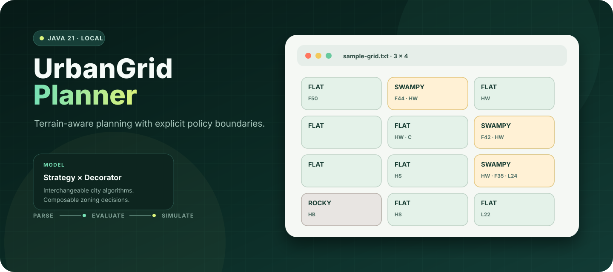
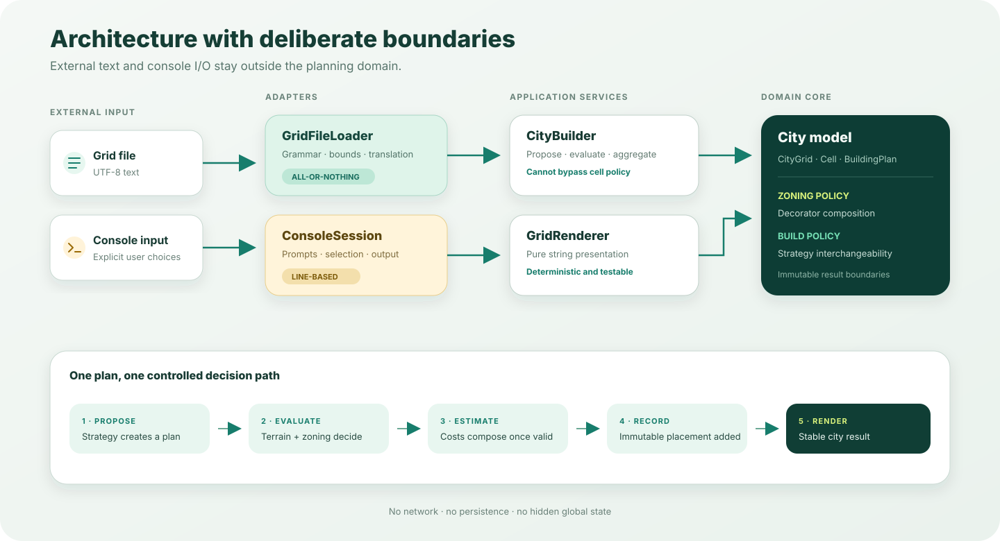

<p align="center">
  
</p>

<h1 align="center">UrbanGrid Planner</h1>

<p align="center">
  A Java 21 planning simulator for exploring how terrain, zoning policy, and construction choices interact across a city grid.
</p>

<p align="center">
  <a href="https://github.com/Himath2002/urban-grid-planner/actions/workflows/ci.yml"></a>
  <a href="https://github.com/Himath2002/urban-grid-planner/releases"></a>
  
  
</p>

## The idea

UrbanGrid Planner turns a compact text file into a validated city model. Each parcel carries a terrain type and any number of composable zoning rules. You can inspect a proposed structure or let one of three planning strategies simulate an entire city.

The interesting part is not the menu—it is the model behind it:

- terrain determines physical feasibility and site preparation cost;
- zoning rules compose at runtime through the Decorator pattern;
- city-wide build behavior is interchangeable through the Strategy pattern;
- parsing, domain logic, orchestration, and presentation have explicit boundaries;
- rejected plans explain *why* they failed instead of returning an opaque result.

## At a glance

| Capability | What it demonstrates |
| --- | --- |
| Strict grid ingestion | UTF-8 parsing, precise validation, bounded input, immutable dimensions |
| Terrain-aware feasibility | Swamp and rocky-site constraints kept inside the domain model |
| Composable zoning | Heritage, height, flood-risk, and contamination decorators |
| Cost modelling | Material, floor, terrain, flood-risk, and contamination adjustments |
| Planning strategies | Uniform, random, and centre-weighted city generation |
| Testable boundaries | Deterministic random injection, UI-independent services, stable rendering |

## Try it

### Requirements

- JDK 21
- No global Gradle installation—the repository includes the Gradle Wrapper

### Run the sample city

macOS or Linux:

```bash
./gradlew run --args="examples/sample-grid.txt"
```

Windows:

```powershell
.\gradlew.bat run --args="examples/sample-grid.txt"
```

The application first renders terrain and zoning, then opens a four-option console:

```text
=== UrbanGrid Planner ===
1. Evaluate one structure
2. Simulate city build (mode: random)
3. Configure build mode
4. Quit
```

### Verify the project

```bash
./gradlew clean build
```

That single command compiles with Java lint warnings treated as errors, runs the JUnit suite, and executes PMD maintainability checks.

## Read the grid

The first line declares `rows,columns`. Every following non-blank line describes one cell in row-major order:

```text
2,3
flat
rocky,height-limit=6
swampy,flood-risk=30,contamination
flat,heritage=brick
flat
rocky,height-limit=10,flood-risk=15
```

### Cell grammar

```text
terrain[,rule[,rule...]]
```

Terrain values:

- `flat`
- `rocky`
- `swampy`

Zoning rules:

| Rule | Example | Effect |
| --- | --- | --- |
| Heritage material | `heritage=brick` | Accepts only the named material |
| Height limit | `height-limit=6` | Rejects structures above six floors |
| Flood risk | `flood-risk=30` | Requires at least two floors; increases cost by `1 + risk/50` |
| Contamination | `contamination` | Multiplies cost by `1.5`; does not itself reject construction |

Rules are applied in file order and retain the behavior of the rule inside them. Invalid terrain, missing cells, extra records, malformed rules, non-finite risks, and grids above 100,000 cells are rejected with contextual messages.

## How a plan is evaluated

Given a structure proposal, a cell performs the same ordered decision flow every time:

1. validate terrain-specific foundation and material constraints;
2. ask the composed zoning policy whether the plan is permitted;
3. calculate material cost per floor;
4. add swamp or rocky-site preparation cost;
5. apply all zoning cost multipliers;
6. return an immutable estimate—or the complete rejection reasons.

For example, a three-floor brick structure on contaminated swampy land with stilts costs:

```text
material     3 × $30,000  =  $90,000
swamp work   3 × $20,000  =  $60,000
base estimate             = $150,000
contamination × 1.5       = $225,000
```

## Architecture

<p align="center">
  
</p>

```text
src/
├── main/java/io/github/himathahangama/urbangrid/
│   ├── application/    console workflow and entry point
│   ├── domain/         grid, cell, plan, estimate, and value types
│   ├── io/             strict grid-file boundary
│   ├── presentation/   deterministic ASCII views
│   ├── rule/           composable zoning decorators
│   ├── service/        city-wide build orchestration
│   └── strategy/       interchangeable planning algorithms
└── test/java/io/github/himathahangama/urbangrid/
    └── ...             tests mirror production boundaries
```

The package graph points inward: presentation and file parsing translate external input, while the domain has no dependency on console I/O, logging configuration, or Gradle. See [the architecture notes](docs/architecture.md) for invariants and extension paths.

## Planning strategies

### Uniform

One immutable `BuildingPlan` is proposed for every parcel. This makes feasibility differences easy to compare because only terrain and zoning change.

### Random

Floors, foundation, and material are selected independently for each parcel. The generator can be injected, so tests and experiments can reproduce an exact sequence.

### Central

Euclidean distance from the city centre controls density and material:

```text
floors = round(1 + 20 / (distance + 1))
```

The centre receives taller concrete structures; progressively distant parcels move through brick, stone, and wood.

## Engineering quality

- Java 21 toolchain and Gradle Wrapper for repeatable builds
- compiler linting with warnings promoted to failures
- focused JUnit tests for parsing, cost logic, zoning composition, strategies, orchestration, and rendering
- PMD rules selected for correctness and maintainability—not course-specific scoring
- GitHub Actions CI with wrapper validation and read-only permissions
- Dependabot coverage for Gradle and GitHub Actions
- no network calls, credentials, database, analytics, or user-data collection
- bounded file input and no runtime file-writing side effects

## Extend it

Add a zoning rule:

1. extend `RuleDecorator`;
2. delegate behavior that the rule does not change;
3. compose its permission, cost, code, description, and warning behavior;
4. register the token in `GridFileLoader`;
5. add composition and parsing tests.

Add a planning algorithm:

1. implement `BuildStrategy`;
2. return a `BuildingPlan` for each coordinate;
3. expose it through `BuildMode` and `ConsoleSession`;
4. verify both representative coordinates and a city-wide result.

No domain or renderer rewrite is required for either extension.

## Security and privacy

UrbanGrid Planner is local-only. It reads the grid path explicitly supplied at startup and writes no project data, telemetry, credentials, or logs to disk. Input size is capped before cell allocation. For responsible reporting, use the repository’s private vulnerability reporting flow described in [SECURITY.md](SECURITY.md).

## Project history

This repository is a publication-focused evolution of an earlier object-oriented software engineering prototype. The planning behavior and core algorithms remain the author’s original work; the package architecture, validation boundaries, tests, documentation, and build pipeline were refined for maintainability and public review. Legacy generators, binary libraries, cached output, and scoring configuration are intentionally excluded.

## Contributing

Focused issues and pull requests are welcome. Read [CONTRIBUTING.md](CONTRIBUTING.md) before changing file grammar or cost semantics.

## Ownership

Copyright © 2025–2026 Himath Ahangama. All rights reserved.

The source is published for portfolio review and technical evaluation. No permission to copy, redistribute, or create derivative works is granted unless the author provides a separate written license.
